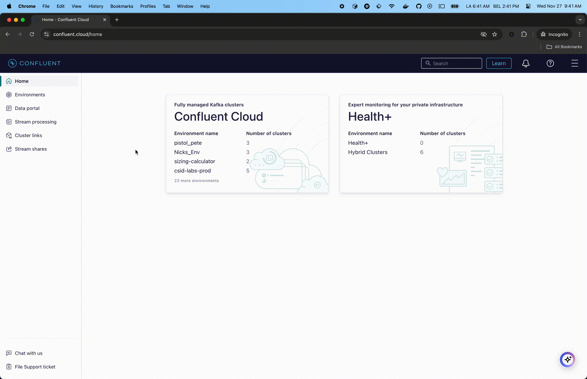

# GenAI Healthcare Quickstart
Welcome to the GCP Healthcare QuickStart! This repository provides a comprehensive guide to quickly
deploy a fully functional chatbot for healthcare. The solution leverages **Confluent
Cloud** and **GCP** to deliver a scalable, intelligent, and real-time conversational
experience.


## Key Features
[//]: <> (change the key concepts accordingly)
* **Real-Time Data Processing**: Powered by Confluent Cloud and Kstreams App, ensuring low-latency communication and
  event-driven architecture.
* **Intelligent Conversations**: Integrated with GCP Gemini AI models for natural and accurate conversational
  responses.
* **Efficient Information Retrieval**: Leverages BigQuery with vector search capabilities for quick and accurate document indexing and retrieval.
* **Scalable and Cloud-Native**:
* **Seamless Deployment**: Follow step-by-step instructions to deploy the entire solution with minimal effort.

## Use Case

This audio chatbot is tailored for healthcare workers as a patient pre-screening application.
Some use cases are:

* Enable doctors to request a comprehensive summary of a patient's medical records before their scheduled appointment. The generated summary will provide the doctor with all relevant and essential information needed to facilitate informed decision-making during the consultation.
* Ensuring that critical patient data—such as past diagnoses, medications, allergies, and recent test results—is readily available in a concise and accessible format.
* Streamline the pre-appointment review process.


👉 Please note that this quick start builds a working AI infrastructure for you, but it's fueled by a small quantity of
fake data, so the results won't be at the level that you're accustomed to with AI chatbots like Chat-GPT. Read the Next
Steps section at the end of this document to find out how you can tweak the architecture and improve or alter the AI
results.


## Table of Contents

- [GenAI Healthcare Quickstart](#genai-healthcare-quickstart)
    - [Key Features](#key-features)
    - [Use Case](#use-case)
    - [Table of Contents](#table-of-contents)
    - [Architecture](#architecture)
        - [Audio Chatbot](#audio-chatbot)
        - [Key Concepts](#key-concepts)
    - [Requirements](#requirements)
        - [Docker](#docker)
        - [Access Keys to Cloud Services Providers](#access-keys-to-cloud-services-providers)
            - [Confluent Cloud](#confluent-cloud)
            - [GCP](#gcp)
    - [Run the Quickstart](#run-the-quickstart)
        - [1. Bring up the infrastructure](#1-bring-up-the-infrastructure)
        - [2. Have a conversation](#2-have-a-conversation)
        - [3. Bring down the infrastructure](#3-bring-down-the-infrastructure)
    - [Next Steps - Improving the Results](#next-steps---improving-the-results)

## Architecture

Future modifications to this Architecture diagram will be made.

Architecture for handling audio, summarizing, building & executing query and chatbot functionality using a combination of Flink, Kafka Streams and Google APIs . Below is a breakdown of the architecture and its components:


### Audio Chatbot
This section demonstrates how the system interacts with user queries in real time.
1. **Frontend:** The frontend handles interactions with users. User audios are sent to a topic for further processing.
2. **Websocket:** Provides real-time communication between the frontend and backend for immediate responses.
3. **Model Inference:** Google Gemini is used for model inference to generate responses.
4. **Output to User:** The system sends the processed results back to the user via the websocket.

[//]: <> (change the key concepts accordingly - kept the embeddings since we will be using them)

### Key Concepts

1. **Embeddings:** These are vector representations of text, allowing the system to handle semantic search.

2. **Google Gemini:** Used for both summarization and generating responses in natural language.

## Requirements

### Docker

The `deploy`script builds everything for you, the only required software is Docker.

Follow the [Get Docker](https://docs.docker.com/get-docker/) instructions to install it on your computer.

### Access Keys to Cloud Services Providers

Once you have `docker` installed, you just need to get keys to authenticate to the various CSPs.

#### Confluent Cloud



For Confluent Cloud, you need to get a *Cloud resource management* key.

If you don't already have an account, after signing up, click the top right corner menu (AKA the hamburger menu) and
select *API keys*.


Click the *+ Add API key* button, select *My Account* and click the *Next* button (bottom right).
If you feel like it, enter a name and description. Click the *Create API Key* (bottom right).


#### GCP


For Google Cloud, you will need a Gemini API Key and your Project Id.
If you don't already have an account, after signing up, go to you *Console* screen, you will see your Project Id there right under the Welcome. Save this for later.
After that go to the top left menu and choose the *APIs & Services*.
Click *Credentials* tab on the left side and click *+Create Credentials*, choose *API Key*.
Save this API Key to use when it is asked by the application when you run your deploy.sh.


## Run the Quickstart

### 1. Bring up the infrastructure

```sh
./deploy.sh
# Follow the prompts to enter your API keys and other credentials
```
```sh
GCP_REGION="<region of your GCP project>"
GCP_PROJECT_ID="<project id of your GCP - you have retrieved above>"
GCP_GEMINI_API_KEY="<GCP Gemini API Key - you have retrieved above>"
GCP_ACCOUNT="<email on your GCP account>"

CONFLUENT_CLOUD_API_KEY="Confluent CLoud API Key - you have retrieved above"
CONFLUENT_CLOUD_API_SECRET="Confluent Cloud API Secret - you have retrieved above"
CONFLUENT_CLOUD_REGION="<Confluent Cloud region - default:us-east1>"
```

### 2. Have a conversation

Once the infrastructure is up and running, you can interact with the chatbot by opening the frontend url generated by
terraform.

For example, if the terraform output is:

```sh
...

Service URL: "https://quickstart-healthcare-ai-websocket-zsvndjdv4-666664333300.us-east1.run.app"
...
```

For the purposes of this quickstart, any username and password will be accepted, and after you log in to have a conversation hit the big record button.
#### 2a. Example Conversations
Let's assume the patient's name we have an appointment is Sheila. Here are some example questions to ask:
- What are the summaries of recent appointments with Sheila?
- What type of medicine Sheila uses currently?
- What is the last diagnosis at the latest appointment of Sheila?


### 3. Bring down the infrastructure

```sh
./destroy.sh
```

## Next Steps - Improving the Results