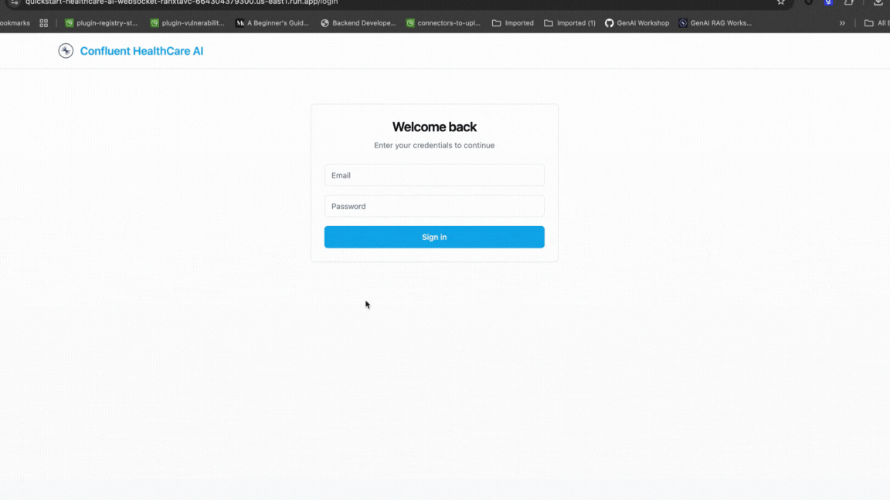

# GenAI Healthcare Quickstart
Welcome to the GenAI Healthcare Quickstart! This repository provides a step-by-step guide for deploying a fully functional Natural Language Voice Assistant in the healthcare domain. 

Leveraging Confluent Cloud for real-time data streaming and Google Cloud Platform for advanced AI (via “Gemini” models) and data warehousing (BigQuery), this solution demonstrates how to build an intelligent, scalable, and cloud-native conversational experience.

## Table of Contents

- [GenAI Healthcare Quickstart](#genai-healthcare-quickstart)
    - [Key Features](#key-features)
    - [Use Case](#use-case)
    - [Table of Contents](#table-of-contents)
    - [Architecture](#architecture)
        - [Natural Language Voice Assistantt](# Natural Language Voice Assistant)
        - [Key Concepts](#key-concepts)
    - [Requirements](#requirements)
        - [Docker](#docker)
        - [Access Keys to Cloud Services Providers](#access-keys-to-cloud-services-providers)
            - [Confluent Cloud](#confluent-cloud)
            - [GCP](#gcp)
    - [Run the Quickstart](#run-the-quickstart)
        - [1. Bring up the infrastructure](#1-bring-up-the-infrastructure)
        - [2. Have a conversation](#2-have-a-conversation)
        - [3. Bring down the infrastructure](#3-bring-down-the-infrastructure)
    - [Next Steps - Improving the Results](#next-steps---improving-the-results)


## Key Features
[//]: <> (change the key concepts accordingly)
* **Real-Time Data Processing**: Powered by Confluent Cloud and Kstreams App, ensuring low-latency communication and
  event-driven architecture.
* **Intelligent Conversations**: Integrated with GCP Gemini AI models for natural and accurate conversational
  responses.
* **Efficient Information Retrieval**: Leverages BigQuery with vector search capabilities for quick and accurate document indexing and retrieval.
* **Scalable and Cloud-Native**: Built with modern cloud architecture to ensure high availability, elasticity, and effortless scaling.
* **Seamless Deployment**: Follow step-by-step instructions to deploy the entire solution with minimal effort.

## Use Case

This Natural Language Voice Assistant is tailored for healthcare workers as a patient pre-screening application.
Possible uses cases are:

* Enable doctors to request a comprehensive summary of a patient's medical records before their scheduled appointment. The generated summary will provide the doctor with all relevant and essential information needed to facilitate informed decision-making during the consultation.
* Ensuring that critical patient data—such as past diagnoses, medications, allergies, and recent test results—is readily available in a concise and accessible format.
* Streamline the pre-appointment review process.


👉 Please note that this quick start builds a working AI infrastructure for you, but it's fueled by a small quantity of
fake data, so the results won't be at the level that you're accustomed to with AI applications such as ChatGPT. Read the Next
Steps section at the end of this document to find out how you can tweak the architecture and improve or alter the AI
results.


## Architecture

**Future modifications to this Architecture diagram will be made.**

Architecture for handling audio, summarizing, building & executing query and chatbot functionality using a combination of Flink, Kafka Streams and Google APIs . Below is a breakdown of the architecture and its components:


### Natural Language Voice Assistant

This section demonstrates how the system interacts with user queries in real time.
1. **Frontend:** The frontend handles interactions with users. User audios are sent to a topic for further processing.
2. **Websocket:** Provides real-time communication between the frontend and backend for immediate responses.
3. **Model Inference:** Google Gemini is used for model inference to generate responses.
4. **Output to User:** The system sends the processed results back to the user via the websocket.

[//]: <> (change the key concepts accordingly - kept the embeddings since we will be using them)

### Key Concepts

1. **Embeddings:** These are vector representations of text, allowing the system to handle semantic search.

2. **Google Gemini:** Used for both summarization and generating responses in natural language.

## Requirements

#### Docker

The `deploy` script automates the entire build process; the only required software is Docker.
Docker can be installed by following the official instructions - [Get Docker](https://docs.docker.com/get-docker/).
---
## Access Keys to Cloud Services Providers

After installing `docker`, the next step is to obtain the necessary authentication keys for the respective cloud service providers (CSPs).

### Confluent Cloud


For Confluent Cloud, a *Cloud Resource Management* API key is required.

If an account is not already set up, sign up first. Then, navigate to the top-right corner menu (also known as the hamburger menu) and select *API Keys* to generate the required key.


Click the *+ Add API key* button, select *My Account* and click the *Next* button (bottom right).
If you feel like it, enter a name and description. Click the *Create API Key* (bottom right).

---
### GCP


For Google Cloud, both a **Gemini API Key** and the **Project ID** are required.

If an account hasn’t been created yet, sign up and navigate to the *Console* screen. The **Project ID** will be displayed just below the welcome message—be sure to save this for later use.

Next, open the top-left menu and select **APIs & Services**.  
Click the **Credentials** tab on the left, then click **+ Create Credentials** and choose **API Key**.  
Save this API key, as it will be required by the application when running the `deploy.sh` script.

If not enabled yet please navigate to the **+Enable APIs and Services** tab to enable  APIs below.
- Artifact Registry API
- Cloud Build API
- Cloud Run Admin API
---
## Run the Quickstart

### 1. Bring up the infrastructure

```
./deploy.sh
# Follow the prompts to enter your API keys and other credentials
```
```
GCP_REGION = "<region of your GCP project>"
GCP_PROJECT_ID = "<project id of your GCP - you have retrieved above>"
GCP_GEMINI_API_KEY = "<GCP Gemini API Key - you have retrieved above>"
GCP_ACCOUNT = "<email on your GCP account>"

CONFLUENT_CLOUD_API_KEY = "<Confluent Cloud API Key - you have retrieved above>"
CONFLUENT_CLOUD_API_SECRET = "<Confluent Cloud API Secret - you have retrieved above>"
CONFLUENT_CLOUD_REGION = "<Confluent Cloud region - default:us-east1>"
```

### 2. Have a conversation!

Once the infrastructure is deployed, the Natural Language Assistant can be accessed by opening the frontend URL generated by Terraform.

For example, if the Terraform output is: 

```
Service URL: "https://quickstart-healthcare-ai-websocket-zsvndjdv4-666664333300.us-east1.run.app"
```

For the purposes of this quickstart, any email and password will be accepted, and after you log in to have a conversation hit the record button.



#### 2a. Example Conversations

> [!IMPORTANT]
>Please keep in mind that for the sake of this quickstart you are the healthcare worker who would like to get the appointment related information
of your patient.


Let's assume the patient's name we have an appointment is Justin Evans. Here are some example questions to ask:
- What are the summaries of recent appointments with Justin Evans?
- What type of medicine Justin Evans uses currently?
- What is the last diagnosis at the latest appointment of Justin Evans?

[//]: <> (#### 2b. Queries)

### 3. Bring down the infrastructure

Please note: Running this script will remove all previously deployed resources, including cloud infrastructure, data platform assets, and streaming applications, ensuring a clean state for subsequent use.

```
./destroy.sh
```

## FAQ
### When I run destroy.sh I encounter **gcp reauth needed** error. How can I solve this problem?
Because of the timeout of your credentials gcloud needs to be reauthenticated.
This function is not enabled while you have an existing .config file.
Try both .config files under **root** and **/services** directory.


### Where can I see my deployed kstreams apps?
Deployments can be found under GCP Cloud Run. Along with your kstream apps you can find your websocket app here as well.
That way for later use you can find you UI url under deployed websocket app in Cloud Run.


### Which deploy.sh and destroy.sh I should run?
The root directory script files are enough to run when deploying and destroying the project.


### Is there a shortcut to pass environment variables once instead providing them every time I deploy?
Yes, after your first deploy you can find all of them under your .env file. Be sure to export those before your next deploy.

## Next Steps - Improving the Results